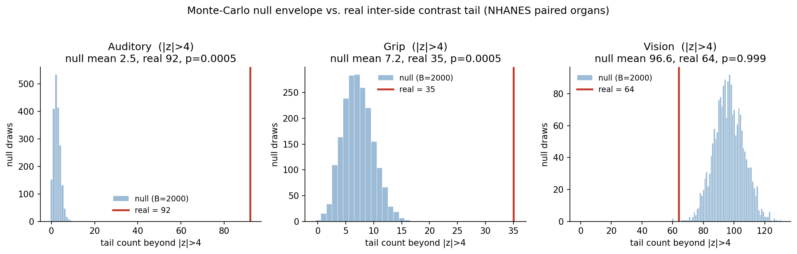
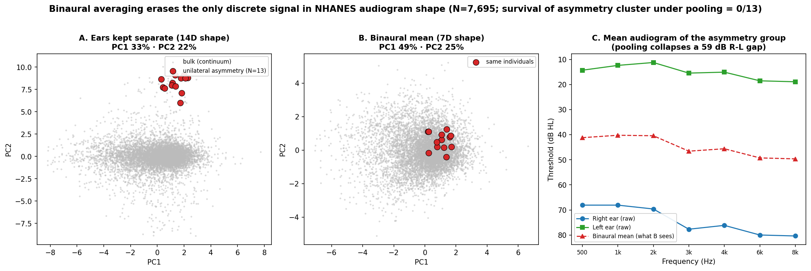

# Signal or Artifact? A Null-Calibrated, Cross-System Audit of Interaural Asymmetry in Paired-Organ Measurements (NHANES: Auditory, Motor, Visual)

**Authors:** Gabriel Vinicius Nascimento¹
**Affiliations:** ¹The Frequency Project, Brazil
**Corresponding author:** gabrielviniciusnascimento345@gmail.com
**Date:** 2026-06-14
**Status:** Draft v6 — cross-system reframe, full draft. Supersedes the audiometric-subtype framing of `PAPER_DRAFT_v5_audit.md` (retained for history). The v5 reproducibility audit is folded in here as one of three systems.

> **Transparency & open-science statement.** Every number here is reproducible from the numbered scripts and saved JSON outputs in the public repository (https://github.com/gabrielviniciusnascimento/the_frequency_ml). The central claims were stress-tested by an adversarial pre-commit audit (scripts `audit_01`–`audit_08`): the auditory excess survived null resampling, inclusion criteria, and a level-dependent measurement-noise null, while an earlier *lateralized-trauma* interpretation was **withdrawn** once the tail proved bilaterally symmetric, and the grip limb was **downgraded** when it failed a tail-dependent null. The full record of claims tested, hardened, and corrected is in `CHANGELOG.md`.

---

## Abstract

**Background.** Many clinical measurements are made on paired organs — the two ears (audiogram), the two hands (grip strength), the two eyes (refraction) — and each yields an interaural/inter-side difference. Distinguishing a *genuine* unilateral-asymmetry signal from an artifact of preprocessing, of the two sides' correlation structure, or of an arbitrarily chosen cutoff is a general and largely unaddressed problem. In the specific case of audiometry, a decade of unsupervised-learning work has instead pursued discrete "phenotypes" or "subtypes," a question that larger studies have already answered in favor of a continuum (Allen & Eddins, 2010; Dimitrov et al., 2026). We deliberately step off that contested ground.

**Objective.** We ask a question that is logically prior and generic across organ systems: *does a paired-organ measure carry a real non-Gaussian tail of unilateral asymmetry — beyond what its own marginal distributions and inter-side correlation can produce — and how strong is that tail across different paired systems?*

**Methods.** We define a four-step, measure-agnostic protocol: (a) verify the anatomical pairing of the two channels from the source documentation; (b) build the bilateral feature space and decompose it into inter-side *sum* (level) and *difference* (contrast); (c) calibrate against a Gaussian-copula null that preserves each side's marginal and the inter-side rank correlation; (d) sanity-check the extreme cases individually against the raw measurements. We applied this protocol — with identical clustering hyperparameters, null construction, and random seed (inclusion criteria stated per system, §2.3) — to three NHANES paired-organ systems: pure-tone auditory thresholds (N = 7,695), hand grip strength (N = 8,335), and objective ocular autorefraction (N = 7,057). To compare systems across incommensurable native units (dB, kg, dioptres) we standardized each inter-side contrast by the standard deviation of the real contrast and counted the tail at |z| > 2…5. Rather than report counts from a single null realization, we built a **Monte-Carlo envelope** (B = 2,000 copula regenerations) giving an empirical *p* for each tail, and we stress-tested the auditory result against (i) fully unfiltered inclusion and (ii) a heteroscedastic measurement null whose per-channel noise grows with threshold level.

**Results.** Against the Monte-Carlo envelope, the **auditory** system carries a far-tail of inter-ear contrast that the copula null essentially never reaches: at |z| > 4, 92 real cases vs a null mean of 2.5 (95% interval [0, 6], maximum 9 across 2,000 draws), empirical *p* = 0.0005, significant under Bonferroni correction over all 12 system×level cells. The **grip** far-tail exceeds the *Gaussian* null (|z| ≥ 4, *p* = 0.0005), though its moderate |z| > 2 shoulder sits *below* it; but this excess is **fragile** — against a tail-dependent Student-t copula (ν = 4) the grip tail no longer exceeds its null at any level (|z| > 4: 35 real vs mean 49, *p* = 0.99; §3.4), so grip's asymmetry is consistent with bilateral tail dependence rather than a genuine excess beyond it. The **visual** system lies within or below its null at every level (|z| > 4: 64 real vs null mean 96; |z| > 5: 40 vs 35, *p* = 0.23) and so serves as a general-population **negative control** — the earlier single-draw "40:28" was a within-envelope fluctuation. The dimensionless gradient is therefore one of *magnitude*, **auditory ≫ grip > vision**, and it is **not** an artifact of the auditory abnormality (ANY25) filter: with all systems left fully unfiltered the auditory excess persists (|z| > 4 real/null ≈ 19, *p* = 0.001) and the ordering is preserved. The auditory contrast is real rather than a preprocessing artifact — it lives in the inter-side *difference* subspace (extreme-case recovery 0.92) and vanishes in the *sum*/level subspace (0.0), and it survives the heteroscedastic measurement null at |z| ≥ 3 (*p* = 0.0005) though not at |z| > 2. Crucially, the tail is **bilaterally symmetric**: of the 69 cases with a >50 dB inter-ear gap, 38 are right-worse and 31 left-worse (binomial *p* = 0.47), so the often-cited "N = 13" extreme group is *one side* of a symmetric tail isolated by the clustering, not a lateralized phenomenon. Binaural averaging — a routine curation step for paired organs — deletes this contrast dimension entirely (separate-ear cases collapse to noise after averaging). Auditory and grip extreme cases passed individual sanity checks (verified anatomical side, no leaked special codes).

**Conclusions.** The *magnitude* of the non-Gaussian inter-side contrast tail varies systematically across paired-organ systems (auditory ≫ grip > vision), and the auditory excess is robust to null resampling, to inclusion criteria, and to level-dependent measurement noise. We make **no directional, individual-level, or etiologic claim**: the auditory tail is bilaterally symmetric, so it does *not* evidence a lateralized insult; NHANES carries no confirmed lateralized-exposure data; and the grip (2011–2014) and vision (1999–2002) cycles do not overlap, so a per-person cross-system test is impossible by calendar. The contribution is methodological: a reusable, null-calibrated audit — Monte-Carlo envelope, sum/difference decomposition, a general-population negative control, and a measurement-noise null — that separates a real inter-side contrast excess from statistical and measurement artifact in any paired measurement.

**Keywords:** paired-organ measurements, interaural asymmetry, copula null model, reproducibility, NHANES, audiometry, grip strength, autorefraction, negative control

---

## 1. Introduction

Much of clinical measurement is bilateral. Audiometry records a threshold for each ear at each frequency; dynamometry records a maximal grip for each hand; autorefraction records a spherical equivalent for each eye. In every case the two sides are not independent — they share genetics, age, systemic disease, and a common developmental program — and in every case the *difference* between the sides can carry clinically important information, because the canonical causes of unilateral disease (acoustic trauma and sudden sensorineural loss in the ear; stroke, nerve injury, and disuse in the hand; amblyogenic anisometropia in the eye) act on one side at a time. A recurring analytical question therefore arises whenever paired data are clustered or profiled: when we see a subset of individuals with a large inter-side difference, is it a *real* unilateral signal, or an artifact — of the preprocessing, of the two sides' correlation structure, or of where we drew the threshold?

This question is easy to get wrong in three specific ways, each of which we encountered and had to neutralize. First, **ipsative preprocessing**. Row-centering (subtracting each individual's mean across channels) is standard for isolating the *shape* of a profile from its overall level, but it is ipsative: it can make a perfectly normal channel appear extreme simply because the per-row mean was pulled by a genuinely abnormal channel elsewhere. An apparent inter-side asymmetry can thus be partly an arithmetic consequence of centering rather than independent evidence. Second, **second-order structure**. Two highly correlated sides will, under any smooth joint model, occasionally produce a large difference; counting "extreme" cases without a null that already contains the real marginals and the real inter-side correlation will mistake the ordinary tail of a correlated continuum for a discovery. Third, **threshold-picking**. Choosing the "extreme" cutoff in native units (a dB gap, a kg gap, a dioptre gap) and reporting that the null produced zero cases at that cutoff is not a result if the cutoff was chosen, per system, to make the null produce zero — different native cutoffs can correspond to very different positions in standard-deviation units, so cross-system comparisons of such counts are not comparable at all.

In audiometry specifically, the literature has spent its effort elsewhere — on whether unsupervised methods recover discrete "audiometric phenotypes." We do not re-litigate that question, and we concede it. Cross-sectional principal-component work (Allen & Eddins, 2010) and very large recent cohorts (Dimitrov et al., 2026; and continuous, low-dimensional descriptions such as Encina-Llamas et al., 2024) converge on the view that population audiogram *shape* is a continuum and that reported subtype counts are unstable segmentations of it. Our own reproducibility checks reproduce that conclusion (weak silhouette at every k, a shallow and specification-dependent BIC optimum, seed-unstable partitions). We take the continuum as settled and reframe the problem away from "how many subtypes are there?" toward the prior, generic question above: **for a paired-organ measure, is there a real non-Gaussian unilateral-asymmetry tail, and how does its strength compare across organ systems that differ in their exposure to lateralized insult?**

Reframing this way buys two things. It converts a crowded, conceded question into a sharp, falsifiable one with a built-in null; and it makes the analysis *portable* — the same protocol can be run on any paired measurement, which in turn supplies a check that a single-system study cannot. If a measurement-agnostic pipeline reports an asymmetry excess in one system, the most convincing evidence that the pipeline is not simply fabricating excess is to run it unchanged on a paired system where strong central coupling makes a large real excess biologically unlikely. The visual system is the natural candidate: the refractive states of the two eyes are tightly coordinated by emmetropisation, so beyond rare anisometropia the inter-eye difference should be small and well described by a correlated continuum. Vision thus serves as an **internal negative control** for the method, not as a system of primary interest.

Our contribution is fourfold. (1) A **generic four-step audit** for distinguishing real inter-side contrast from artifact in any paired-organ measurement — anatomical-pairing verification, sum/difference decomposition, Gaussian-copula calibration, and individual sanity-checking of extremes — hardened with a Monte-Carlo null envelope (empirical *p* rather than single-draw counts) and a measurement-noise null. (2) A **dimensionless tail metric** that standardizes the inter-side contrast by the real-data standard deviation, removing the threshold-picking problem and making native-incommensurable systems directly comparable. (3) An **empirical cross-system result** on three NHANES paired systems run with identical modelling code: a strict, monotone *magnitude* gradient, auditory ≫ grip > vision, with the general-population visual system within or below its own null. (4) An explicit, **honest boundary** on what this can and cannot mean: it is a population-level, system-level statement about the *magnitude* of inter-side contrast — the auditory tail is bilaterally symmetric, so we make **no directional, etiologic, or lateralized-exposure claim** — and it makes no individual-level cross-system claim, the grip and vision survey cycles not overlapping. We keep the nomenclature deliberately neutral throughout — *inter-side contrast tail*, *non-Gaussian outliers* — and avoid "subtype," "phenotype," or "discrete mode," none of which the data support.

---

## 2. Methods

### 2.1 A four-step audit for paired-organ asymmetry

The protocol is deliberately measure-agnostic; nothing in it is specific to hearing. It has four steps. **(a) Anatomical-pairing verification.** Before treating two columns as "right" and "left," we confirm from the source documentation that they encode anatomical side rather than acquisition order or another nuisance, and we recode any special "could-not-measure" codes to missing rather than letting them enter as numbers. **(b) Bilateral space and sum/difference decomposition.** We assemble the per-individual bilateral vector and rotate each side-pair $(R_i, L_i)$ into a *sum* $s_i=(R_i+L_i)/2$ (overall level) and a *difference* $d_i=R_i-L_i$ (inter-side contrast); a real unilateral signal must live in the difference subspace and vanish in the sum. **(c) Null calibration.** We compare the real inter-side contrast against a Gaussian-copula null that preserves each side's empirical marginal and the inter-side rank correlation, so that any "excess" is excess over the ordinary tail of a correlated continuum rather than over independence. **(d) Sanity-checking of extremes.** Every individual in the extreme tail is inspected against the raw measurements (per-trial/per-frequency values, quality flags) to exclude single-point measurement artifacts.

### 2.2 Data: three NHANES paired-organ systems

All data are public NHANES files, downloaded over HTTP from the CDC with content validation (rejecting non-XPT/HTML responses) and SHA-256 hashing.

**Auditory (objective threshold).** Pure-tone air-conduction thresholds at 500–8000 Hz in both ears (14 values) from the Audiometry (AUX) files, nine cycles 1999–2020. Special codes 666 (no response) and 888 (could not obtain) were set to missing before any modelling. Filters: age 20–69, completeness ≥10/14, and audiometric alteration (≥1 frequency >25 dB HL), giving **N = 7,695**. Side mapping is direct (the files label each ear).

**Motor (grip strength).** Maximal hand grip (kg) from the Muscle Strength – Grip Test (MGX), the two cycles that carry it (MGX_G 2011–2012, MGX_H 2013–2014). Here the source variables `MGXH1*`/`MGXH2*` encode the **order** in which the hands were tested, not anatomical side; we reconstructed anatomical right/left per individual by crossing them with `MGATHAND` ("begin the test with this hand"; 1 = right, 2 = left). Because `MGATHAND` is ~50/50 across the sample, a naïve "hand 1 = right" assignment would mislabel side for roughly half of participants; 1,128 rows with missing `MGATHAND` were excluded rather than imputed. Per-hand strength is the maximum of three trials. Ages 20–69 with both hands measured give **N = 8,335** (the clustering pipeline used N = 8,304 with all six trials present).

**Visual (objective refraction).** Spherical equivalent (sphere + cylinder/2) per eye from objective autorefraction (VIX 1999–2000, VIX_B 2001–2002; identical variable names verified in both). Code 88 (could not obtain) was set to missing. Right/left (OD/OS) are anatomically direct, with no ordering ambiguity. Ages 20–69 with both eyes measured give **N = 7,057**.

### 2.3 Identical pipeline across systems

To make divergences between systems a finding rather than a tuning choice, every system passed through the **same** modelling code with the **same** constants and a single fixed `random_state = 42`. The bilateral vector is row-centered, scaled with RobustScaler (IQR 25–75), and reduced by PCA retaining 95% of variance. The clustering battery is K-means (k = 2–10, 12 seeds each; silhouette, the Gap statistic, and mean seed-to-seed Adjusted Rand Index), Gaussian Mixture Models (k = 2–10 under full/tied/diagonal/spherical covariance, n_init = 10; BIC), and HDBSCAN (min_cluster_size = 10, min_samples = 5). No clustering or null hyperparameter was changed per system.

One thing was **not** identical and we state it plainly: the *inclusion* criterion. The auditory sample was restricted to audiograms with at least one threshold > 25 dB HL (an "ANY25" abnormality filter inherited from the v5 audit), whereas grip and vision were included whenever both sides were measured, with no abnormality filter. This asymmetry could in principle inflate the auditory tail relative to the others, so we treat inclusion as a variable rather than a fixed choice and report a three-policy robustness check in §3.3 (no filter on any system; an abnormality filter on every system; and the as-published mixed policy).

### 2.4 Copula null and the dimensionless tail metric

For each system we generated (i) a **continuous null** by a Gaussian copula on the inter-side ranks (preserving real marginals and the real rank correlation) and (ii) a **discrete level control** of two well-separated, side-symmetric strength/level groups. Native cutoffs (dB, kg, dioptres) are not comparable across systems and invite threshold-picking, so we standardized the inter-side contrast as $z = (R-L)/\mathrm{SD}(R-L_{\text{real}})$ — the **same** real-data SD applied to both real and null — and count the tail at $|z| > 2, 3, 4, 5$.

A single copula realization gives only a point count, with no sense of sampling variability; an earlier draft reported "X vs 0" counts that were one draw each. We therefore replace them with a **Monte-Carlo envelope**: each copula is regenerated $B = 2{,}000$ times (`RandomState(b)`, $b = 0\ldots1999$), giving a null distribution of tail counts per $|z|$ and an empirical $p = (\#\{\text{null} \ge \text{real}\}+1)/(B+1)$ (floor $\approx 5\times10^{-4}$). We judge significance against a Bonferroni threshold of $0.01/12$ over the three systems × four levels. Finally, for the auditory system — where an artifact would matter most — we add a **heteroscedastic measurement null** that augments the copula draw with per-channel Gaussian noise of $\mathrm{SD} = 5 + 0.1\cdot\text{level}_{\text{dB}}$ (≈17 dB at 120 dB HL), a deliberately hostile model of level-dependent audiometric measurement error (§3.4). We further test the auditory tail against a **Student-t copula** (ν = 4), which — unlike the Gaussian copula — carries tail dependence and so can itself generate large joint excursions, and we calibrate detector power by **injecting** known-magnitude one-sided gaps (30–60 dB) into the copula null and measuring recall (§3.4). Scripts: `audit_01`–`audit_08`.

### 2.5 Sanity, software, reproducibility

Extreme cases were inspected individually (Section 3.4–3.5). Analyses used Python (NumPy, pandas, scikit-learn, hdbscan, SciPy) in a pinned environment; all numbers are reproducible from numbered scripts and saved as JSON with traceable participant identifiers (SEQN). No survey weights are applied; nothing here is a prevalence estimate.

---

## 3. Results

### 3.1 No comparable discrete structure within any system

Within each system the clustering battery gave no support for discrete, well-separated groups in the *shape/level* space. For audition the best silhouette was weak (0.28 at k = 2, falling to ≤0.18 for k ≥ 3), the Gap statistic preferred k = 2, the only GMM interior BIC optimum was shallow (~1.5% of the mean) and appeared under a single covariance specification, and HDBSCAN returned one dominant mass (92.2%) with 7.6% noise. Grip behaved the same way (best silhouette 0.24 at k = 2; Gap k = 2; BIC well 0.60% deep). We treat the auditory continuum as established prior work (Section 1) and reproduce it here as one instance of a general pattern. The visual clustering is **not comparable and is not interpreted**: with only two bilateral features the row-centered space collapses to a single principal component, so the high nominal silhouette (0.73) and the 38 HDBSCAN micro-clusters reflect a strongly peaked one-dimensional distribution plus the 0.25 D measurement grid — a lattice artifact, not structure. Vision enters this study only through the tail test below.

### 3.2 A real far-tail in the auditory and grip systems, calibrated against a null envelope

Replacing single-draw counts with the $B = 2{,}000$ Monte-Carlo envelope (§2.4) changes the framing from "X vs 0" to a tested excess (Table 1). For the **auditory** system the real far-tail is far outside the null distribution at every level: at $|z|>4$, 92 real cases against a null mean of 2.5 (95% interval [0, 6], maximum 9 over 2,000 draws); at $|z|>5$, 52 real against a null mean of 0.1 (maximum 3). The empirical $p$ is at the floor ($5\times10^{-4}$) for $|z|\ge3$ and survives Bonferroni correction. The **grip** far-tail also exceeds its null ($|z|>4$: 35 real vs mean 7.2, $p = 5\times10^{-4}$; $|z|>5$: 14 vs 0.3), although its moderate $|z|>2$ shoulder lies *below* the null (559 vs mean 646, $p \approx 1$), so grip's genuine excess is confined to the far tail. The **visual** system lies within or below its null at every level ($|z|>4$: 64 real vs mean 96, $p \approx 1$; $|z|>5$: 40 vs mean 35, $p = 0.23$): it produces no excess the copula cannot match, the basis for its negative-control role (§4.2). The discrete level control produced essentially no inter-side asymmetry, confirming that discrete structure in *level* does not by itself create a difference tail.

### 3.3 The gradient is one of magnitude, and it is not a selection artifact

On the common $z$ scale the ordering of far-tail excess is strict and monotone — **auditory ≫ grip > vision** — at every level (Table 1, Figure 1): at $|z|>4$ the real/null-mean ratio is ≈37 (auditory), ≈5 (grip), and ≈0.7 (vision, below null). Because the published auditory sample carried an ANY25 abnormality filter that grip and vision did not (§2.3), we tested whether this gradient is a selection artifact by recomputing the envelope under three inclusion policies (`audit_02`). It is not. With **no abnormality filter on any system**, the auditory excess persists strongly ($N = 13{,}433$ unfiltered; $|z|>3$ real/null ≈ 4.3, $|z|>4$ ≈ 19.3, both $p = 0.001$) and the ordering auditory ≫ grip > vision is preserved (grip $|z|>4$ ratio ≈ 5.0; vision ≈ 0.7, below null). One qualification follows from the third policy: when *every* system is restricted to abnormal cases, vision develops a real excess of its own ($|z|>4$ ratio ≈ 5.2, $p = 0.001$, from anisometropia-prone eyes). Vision's "below null" status is therefore a property of the **general population**, not of abnormality-matched eyes — a distinction we carry into the negative-control argument (§4.2). The three systems also differ in *how hostile a null* their excess survives, and only the auditory limb is fully robust: the auditory excess survives the Gaussian, heteroscedastic, and tail-dependent (t-copula) nulls, whereas grip's far-tail excess survives the Gaussian null but is absorbed by the t-copula (§3.2). The defensible gradient is thus auditory (robust to every null) ≫ grip (excess over Gaussian dependence only) > vision (no excess).

### 3.4 The auditory tail is a real, bilaterally symmetric inter-ear contrast, not a preprocessing or measurement artifact (sub-result)

Because the auditory tail is the strongest, it is also where an artifact would matter most, so we audited it specifically along three axes: is the contrast real in the raw data, does it survive measurement noise, and is it lateralized?

*Real in the raw data, not a centering artifact.* The sum/difference decomposition localizes the signal unambiguously: the extreme cases are recovered in the raw **difference** (contrast) subspace (recovery 0.92) and are entirely absent from the **sum**/level subspace (0.0). Taking the right-worse extreme group as a worked example, its impaired ear is genuinely abnormal (PTA z = +3.5, 99th population percentile) and its intact ear is normal (PTA z = −0.7, 26th percentile), an inter-ear contrast of 59 dB exceeding 99.6% of the sample; the apparent "extremeness" of the intact ear in centered space is a relocation induced by ipsative centering, but the *contrast itself is real in the raw thresholds*.

*Survives a heteroscedastic measurement null.* A Gaussian copula excludes only second-order dependence, not level-dependent measurement error. Against the hostile measurement null (per-channel SD = 5 + 0.1·level, §2.4; `audit_04`) the far-tail excess survives at $|z|\ge3$ ($p = 5\times10^{-4}$; real/null ratio 17 at $|z|>4$, 133 at $|z|>5$) but **not** at $|z|>2$ (ratio 1.06, $p = 0.10$). The moderate shoulder is therefore consistent with measurement noise; the defensible claim is the far tail, $|z|\ge3$.

*Bilaterally symmetric, not lateralized.* The HDBSCAN "cluster" of 13 extreme cases is unanimously right-worse, which earlier drafts read as a lateralized signal. It is not: of the 69 cases with a >50 dB inter-ear gap, 38 are right-worse and 31 left-worse (binomial $p = 0.47$); at $|z|>4$, 46 vs 45 ($p = 1.0$); `audit_03`. The 13-case cluster is simply *one side* of a symmetric contrast tail that the density clustering isolated — not evidence that one ear is preferentially affected. (For completeness, the population *mean* leans very slightly left-worse, frac right-worse 0.456, $p \approx 3\times10^{-14}$, the small known population asymmetry; the extreme tail carries no such direction.)

*Binaural averaging deletes the contrast dimension.* Replacing the 14 separate thresholds by 7 binaural means and rerunning the identical pipeline drops recovery of the extreme-contrast group from 13/13 to 0/13 (11 of 13 become noise), and its standardized separation from the bulk collapses from 8.5σ to 1.2σ (silhouette 0.72 → 0.38). Averaging paired channels does not denoise this tail; it removes the only dimension that carries it.

*The defensible unit is the threshold, not the cluster.* Sweeping the HDBSCAN hyperparameters (`audit_06`; `random_state` is inert — the pipeline is deterministic — so the effective grid is min_cluster_size × min_samples) shows the distinct extreme-asymmetry cluster appears in only 35/60 settings (58%) and its size ranges N = 9–24, so "the N = 13 cluster" is not a stable object. An injection control (`audit_08`) confirms the threshold is the better-defined detector: injecting known one-sided gaps into the asymmetry-free copula null, the standardized-contrast detector recalls ≥ 90% of genuine ≥ 50 dB gaps at $|z|>3$ (and 84% at the stricter $|z|>4$), whereas the clustering detector recalls only 57–78% of the same severe injections. We therefore frame the result on the $|z|$ contrast threshold throughout; the cluster is illustrative only.

*External replication (OHHR).* Applying the same decomposition to the Oldenburg Hearing Health Record (OHHR; N = 574, air-conduction HTL at 500–4000 Hz; `audit_07`) reproduces the qualitative finding outside NHANES: a real inter-ear contrast tail (30 cases at $|z|>2$, 9 at $|z|>4$) that is again **bilaterally symmetric** (16 right-worse / 14 left-worse, binomial $p = 0.86$). The cluster-based recovery does not transfer to this smaller, four-frequency cohort (difference-subspace recovery 0.0), consistent with the cluster fragility above — but the contrast tail itself, the defensible unit, replicates and is symmetric, so the effect is not NHANES-specific.

### 3.5 The extreme cases survive individual sanity-checking

The auditory extremes are genuine measurements, not collection artifacts: all 13 have complete 14-threshold audiograms, no special-code (666/888) leakage, and a physiologically sloping impaired ear rather than a ceiling-pinned flat line. The grip extremes are likewise consistent: of the 15 cases beyond 20 kg, 14 show total separation (the weak hand's best trial below the strong hand's worst), none is a single-trial outlier, and 13/15 carry maximal-effort flags on all trials (the remaining two have one questionable-effort trial that does not drive the asymmetry). One grip case rests on a single valid trial for the weak hand and is the thinnest evidence.

### 3.6 No individual-level cross-system overlap is possible

We report the cross-system links only to close them. Of the 13 auditory extremes, 7 have valid grip data and none is also a grip extreme; of the same 13, only 2 have valid vision data and neither is a vision extreme. Critically, the grip and vision cycles **do not overlap in time** (grip 2011–2014, vision 1999–2002), so no participant contributes to both, and the triple intersection is empty by calendar rather than by biology. The gradient in this paper is therefore a property of the three *systems*, established on three (largely disjoint) populations — not a within-person phenomenon, and we make no within-person claim.

**Table 1.** Consolidated cross-system audit (data and integrity; continuum diagnostics; asymmetry tail vs. the Monte-Carlo null envelope with empirical $p$). Numbers from `audit_01`/`audit_02`; a typeset version is in `docs/en/table_crosssystem_asymmetry.tex`.

| | **Auditory** | **Grip** | **Vision** |
|---|---|---|---|
| NHANES component | Audiometry (AUX) | Grip strength (MGX) | Autorefraction (VIX) |
| Cycles | 9 (1999–2020) | 2011–2014 | 1999–2002 |
| *N* | 7,695 | 8,335 | 7,057 |
| Side reconstruction | R/L direct | via MGATHAND | OD/OS direct |
| Sanity of extremes | 13/13 genuine | 15/15 consistent | not audited |
| Best silhouette (*k*) | 0.28 (2) | 0.24 (2) | 0.73 (3)† |
| GMM BIC well depth | 1.5% | 0.60% | 1.49%† |
| HDBSCAN dom. / noise | 92.2% / 7.6% | 9.8% / 90.0% | 14.2% / 1.3%† |
| *R*–*L* correlation | — | 0.933 | 0.912 |
| SD(*R*−*L*), native | 10.97 dB | 4.11 kg | 0.94 D |
| \|z\|>3 real / null mean | **175 / 31.9** | 128 / 94.9 | 104 / 239 |
| \|z\|>4 real / null mean | **92 / 2.5** | **35 / 7.2** | 64 / 96 |
| \|z\|>5 real / null mean | **52 / 0.1** | **14 / 0.3** | 40 / 35 |
| *p* at \|z\|>4 | **5×10⁻⁴** | **5×10⁻⁴** | ≈1 |
| **Verdict** | far-tail excess, robust to 3 nulls, bilaterally symmetric | excess over Gaussian null only (fails t-copula) | within/below null (general pop.) |

† Vision clustering is a 1-D lattice artifact, not comparable to the other two (see §3.1).

**Figure 1.** Monte-Carlo null envelope vs. the real inter-side contrast tail at $|z|>4$ (the headline level) for the three systems: histogram of the $B = 2{,}000$ null tail-counts with a vertical line at the real count (`outputs/dashboards/audit_envelope_figure.png`; per-level data in `audit_01_mc_envelope.json`). The auditory and grip real counts sit far outside their null; the visual real count sits inside it. *Supersedes the earlier point-estimate ratio plot `dimensionless_asymmetry_figure.png`.*

**Figure 2 (auditory sub-result).** Binaural-pooling ablation: the extreme inter-ear contrast group is distinct with separate ears and dissolves under binaural averaging (`outputs/dashboards/pooling_ablation_figure.png`).

---

## 4. Discussion

### 4.1 A reproducible magnitude gradient — without a direction

Run with identical modelling code on three NHANES paired-organ systems, the same audit returns a strict, monotone, null-calibrated gradient in the *magnitude* of the non-Gaussian inter-side contrast tail: auditory ≫ grip > vision. This is the paper's empirical claim, and it is a statement about systems, not individuals — and explicitly about magnitude, not direction. We had initially read the gradient as tracking exposure to *lateralized* insult (one-sided acoustic trauma in hearing; stroke, nerve injury, and disuse in the hand; tightly coordinated emmetropisation in the eye). The data do not support that reading and we withdraw it: the auditory contrast tail is **bilaterally symmetric** (§3.4), so it carries no preferential side and cannot, on its own, be evidence of lateralized trauma. What survives is narrower and firmer — that the *amount* of genuine extreme inter-side contrast, calibrated against each system's own marginals and rank correlation, differs sharply across these systems, and that the auditory excess is robust to null resampling (§3.2), to inclusion criteria (§3.3), and to level-dependent measurement noise (§3.4). Why the magnitudes differ is left open; any exposure interpretation belongs to cohorts that record lateralized exposure and measure more than one paired system per person (§3.6).

### 4.2 Vision as an internal negative control

The value of running a measurement-agnostic pipeline on a system where a large real excess is biologically unlikely is that it tests the *method*, not a hypothesis. In the **general population** vision delivers that test: its tail lies within or below its own null at every level (§3.2), and a pipeline that fabricated asymmetry would not produce a within-/sub-null result. That vision lands there — consistent with tight central coupling of the two eyes — is positive evidence that the auditory and grip excesses are properties of those data and not of the analysis. The control comes with one honest boundary, which the three-policy check (§3.3) surfaces: when vision is restricted to abnormal-refraction eyes, an anisometropic excess does appear. The negative control is therefore the *unselected* visual system, not refraction per se; used that way, it is exactly the no-excess baseline the method needs, and the reason its non-comparable clustering (§3.1) can be set aside.

### 4.3 The artifact traps, and why the contribution is methodological

Each of the artifact traps named in the Introduction would, uncorrected, have produced a misleading result, and the audit added two more that we initially fell into. Ipsative centering does make the intact ear look extreme — but the contrast is real in raw thresholds, and the sum/difference decomposition localizes the signal to the difference subspace where centering cannot manufacture it. Second-order structure does generate a difference tail — but the copula null absorbs it, so what remains is genuine excess. And native thresholds are not comparable — a 50 dB, a 20 kg, and a 10 D cutoff sit at ≈4.5σ, ≈5σ, and ≈10.7σ — so only the dimensionless layer supports a cross-system statement. To these we add: a **single null realization** gives a point count with no sampling variability and tempts "vs 0" claims, which the $B = 2{,}000$ envelope replaces with an empirical $p$; and a Gaussian copula excludes only second-order dependence, **not level-dependent measurement error**, which the heteroscedastic null tests directly (and which dissolves the moderate $|z|>2$ shoulder while leaving the far tail intact). The reusable object here is the four-step protocol plus the standardized tail metric, the Monte-Carlo envelope, the measurement-noise null, and the general-population negative control — together separating a real inter-side contrast excess from statistical and measurement artifact in any paired measurement.

### 4.4 Limitations

We analyse cross-sectional survey data, not clinical cohorts with confirmed etiologies, so we describe statistical structure, not pathophysiology, and we attach no clinical label to any individual. Row-centering removes the overall-level dimension by construction; our auditory claim is about inter-ear *configuration*, and we concede the population audiogram-shape continuum to prior work rather than claiming it. The visual clustering is not comparable to the other two and is used only as a tail test, and its negative-control status holds for the **general population**, not for abnormality-matched eyes (§3.3, §4.2). We calibrate against three null families — Gaussian copula, heteroscedastic measurement, and a tail-dependent Student-t copula — and the auditory excess survives all three; but no finite battery excludes *every* conceivable dependence structure, so "excess over the null" means excess over those families. The grip limb is weaker on exactly this point: its far-tail excess survives the Gaussian null but **not** the t-copula, so it is consistent with bilateral tail dependence and we do not claim a genuine grip excess (§3.2). The far-tail counts are rare-outlier tails, not population strata; the often-cited "N = 13" auditory group is one (right-worse) side of a bilaterally symmetric tail, not a lateralized subgroup, and is hyperparameter-fragile (§3.4), which is why we frame the result on the $|z|$ threshold rather than the cluster. Most importantly, the gradient is established on three largely disjoint populations, makes no within-person claim, and — because the tail is symmetric — makes **no directional or lateralized-exposure claim**; any such interpretation is deferred to cohorts that record exposure and measure more than one paired system in the same people.

### 4.5 Conclusion

Asking whether a paired-organ measurement carries a real inter-side contrast tail — rather than how many subtypes a single system has — yields a sharp, portable, falsifiable question with a built-in null and a built-in control. Applied with identical modelling code to auditory, motor, and visual measurements in NHANES, it returns a reproducible *magnitude* gradient, auditory ≫ grip > vision, with the general-population visual system within or below its own null. The auditory excess is real, far-tailed, and bilaterally symmetric — robust to null resampling, to inclusion criteria, and to level-dependent measurement noise — and it is erased by binaural averaging. We release the audit, with its Monte-Carlo envelope and negative control, so that groups holding cohorts that record lateralized exposure and measure more than one paired system per person can take the directional, etiologic question further. The aim is not a new taxonomy, and not a trauma claim, but a reliable way to tell a real inter-side contrast from artifact when the body is measured in pairs.

---

## References

*Consolidated from `PAPER_DRAFT_v4.md` and `PAPER_DRAFT_v5_audit.md`; metadata independently verified except where flagged. Items quoted only for direction (Dimitrov) are not cited for specific statistics until the source is read.*

**Audiogram-shape continuum and the subtype question (conceded prior work).**
1. Allen, P. D. & Eddins, D. A. (2010). Presbycusis phenotypes form a heterogeneous continuum when ordered by degree and configuration of hearing loss. *Hearing Research*, 264(1–2), 10–20. https://doi.org/10.1016/j.heares.2010.02.001 — Cross-sectional, 960 subjects; PCA + K-means; original evidence that presbycusis phenotypes are a continuous distribution categorically segmented into "sub-types."
2. Dimitrov, L., Lilaonitkul, W. & Mehta, N. (2026). Identification of sensorineural hearing loss subtypes using unsupervised machine learning and assessment of their replicability. *Scientific Reports*, article 33815. https://doi.org/10.1038/s41598-025-33815-9 — GMM on 109,854 UK audiograms; directly addresses replicability of SNHL subtypes. (Cited for direction only; specific Jaccard/stability figures to be quoted after reading the source.)
3. Encina-Llamas, G. et al. (2024). Searching auditory phenotypes beyond audiometry from a large clinical dataset. *Virtual Conference on Computational Audiology (VCCA2024)* [conference presentation]. — Rigshospitalet Copenhagen, 84,280 patients / 288,295 air-conduction thresholds; low-dimensional, continuous rather than discrete organization. (Conference presentation, not peer-reviewed.)
4. Parthasarathy, A., Romero Pinto, S., Lewis, R. M., Goedicke, W. & Polley, D. B. (2020). Data-driven segmentation of audiometric phenotypes across a large clinical cohort. *Scientific Reports*, 10, 6754. https://doi.org/10.1038/s41598-020-63515-5 — GMM; 6 NHANES / 10 clinical phenotypes.
5. Wang, M. et al. (2021). Audiometric phenotypes of noise-induced hearing loss by data-driven cluster analysis. *Frontiers in Medicine*, 8, 662045. https://doi.org/10.3389/fmed.2021.662045
6. Xu, C. (2026). Objective comparison of audiometric profile frameworks across large-scale datasets. *JASA Express Letters*, 6(4), 044402. https://doi.org/10.1121/10.0043212 — Compares six profiling frameworks across five US/German datasets (Davies–Bouldin + PCA).
7. Cruickshanks, K. J., Nondahl, D. M., Fischer, M. E., Schubert, C. R. & Tweed, T. S. (2020). A novel method for classifying hearing impairment in epidemiological studies of aging: the Wisconsin Age-Related Hearing Impairment Classification Scale (WARHICS). *American Journal of Audiology*, 29(1), 59–67. https://doi.org/10.1044/2019_AJA-19-00021 — Longitudinal (1,369 participants, 10,952 audiograms, 1993–2010); an ordered scale of audiogram shape + severity.

**Clustering, replicability, and validity methods.**
8. Tibshirani, R., Walther, G. & Hastie, T. (2001). Estimating the number of clusters in a data set via the gap statistic. *Journal of the Royal Statistical Society B*, 63(2), 411–423.
9. McInnes, L. & Healy, J. (2017). Accelerated hierarchical density-based clustering (HDBSCAN). *ICDM 2017 Workshops*. https://doi.org/10.1109/ICDMW.2017.12
10. Hubert, L. & Arabie, P. (1985). Comparing partitions. *Journal of Classification*, 2(1), 193–218. — Adjusted Rand Index, used here for seed-to-seed stability.
11. Sorooshyari, S. K., Rivas, M. A. & Tibshirani, R. (2026). ERICA: quantifying replicability of cluster analysis. *arXiv*:2606.00302. https://arxiv.org/abs/2606.00302 — Model-free cluster-replicability framework.

**Lateralized insult to paired organs (Discussion hypothesis only).**
12. Cox, H. J. & Ford, G. R. (1995). Hearing loss associated with weapons noise exposure: when to investigate an asymmetrical loss. *Journal of Laryngology and Otology*, 109(4), 291–295. https://doi.org/10.1017/s0022215100129950 — 225 soldiers with weapons-noise exposure; hearing loss significantly greater in the *left* ear at 2–6 kHz. **Currently uncited:** the inline use was removed after `audit_03` showed our extreme tail is bilaterally symmetric (not lateralized). Retained because it remains relevant to a corrected §4.1 lateralization discussion — note that our population mean leans slightly left-worse (consistent with Cox & Ford) while the extreme cluster is right-worse, an asymmetry of the clustering, not of the biology. (Citation verified 2026-06-14; the v4 attribution to "British Journal of Audiology" was incorrect.)

**Data sources and documentation.**
13. Centers for Disease Control and Prevention (CDC), National Center for Health Statistics. National Health and Nutrition Examination Survey (NHANES): Audiometry (AUX) files, 1999–2020. https://wwwn.cdc.gov/nchs/nhanes/
14. CDC/NCHS. NHANES Muscle Strength – Grip Test (MGX_G 2011–2012, MGX_H 2013–2014), including the `MGATHAND` ("begin the test with this hand") variable used for anatomical-side reconstruction.
15. CDC/NCHS. NHANES Vision – Objective Refraction (VIX 1999–2000, VIX_B 2001–2002).

## Disclosure of AI Assistance

Portions of this manuscript were drafted with the assistance of large language models (Claude, Gemini), used for text formatting and language polishing, code generation for the data-processing and analysis scripts, and literature-search organization.

All scientific decisions — the research question, the methodological choices, the data analysis, the interpretation of results, and the conclusions — were developed and verified by the author. Every numerical result reported here was computed from public NHANES data using reproducible Python scripts and was checked by the author against the saved JSON outputs; the complete pipeline is available in the accompanying GitHub repository for independent verification. The author has reviewed and approved all content in this manuscript.
